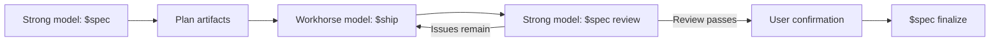

# Specship

Specship separates high-judgment planning from bounded implementation by giving each role its own Codex skill:

- **`$spec`** uses a stronger model to investigate, clarify, specify, review, and explicitly finalize work.
- **`$ship`** uses a faster workhorse model to execute one planned task, validate it, and record evidence.

The two skills communicate through durable Markdown artifacts under `docs/plans/`, so they can run in separate conversations without sharing chat history.

> **Status: private preview.** Specship is being dogfooded and is not ready for public distribution or skills.sh listing yet.
>
> **Built for Codex.** Specship is designed and validated around Codex skill discovery, `$skill` invocation, repository instructions, and shared-workspace behavior. Other Agent Skills-compatible tools may work, but they are secondary and currently unverified targets.

## Why Specship?

Planning and implementation require different kinds of intelligence. A strong model is most valuable when it is resolving ambiguity, understanding architecture, defining success, and reviewing results. Once that judgment is captured in a precise plan, a less expensive model can execute narrow tasks without repeatedly rediscovering the project.

Specship turns that division of labor into an auditable workflow:



## Responsibilities

| Skill | Recommended model | Responsibilities | Must not do |
| --- | --- | --- | --- |
| `$spec` | Higher-intelligence model | Investigate, grill ambiguity, write specifications and plans, review implementation, finalize confirmed work | Implement source changes, silently assume material requirements, finalize without user confirmation |
| `$ship` | Faster workhorse model | Execute one ready task, run validation, update task status, append execution evidence | Invent requirements, broaden scope, perform review, update canonical post-implementation docs |

## Plan artifacts

Every request receives a plain-slug folder:

```text
docs/plans/<plan>/
├── CONTEXT.md   # Original request, evidence, questions, answers, and decisions
├── SPEC.md      # Requirements, constraints, behavior, and acceptance criteria
├── PLAN.md      # Ordered, bounded implementation tasks
├── RESULTS.md   # Execution evidence appended by $ship
└── REVIEW.md    # Review rounds and finalization record written by $spec
```

`CONTEXT.md` preserves the clarification trail. Decisions are superseded rather than silently erased, allowing a fresh model to understand why the plan looks the way it does.

## Workflow

Use separate conversations so each model receives only the context appropriate to its role. The shared repository and plan folder are the handoff mechanism.

### 1. Plan with the strong model

Open a conversation using the stronger model:

```text
$spec Add organization switching to the account settings flow.
```

`$spec` inspects the repository, creates `docs/plans/<plan>/CONTEXT.md`, asks evidence-driven clarification questions, and writes `SPEC.md` and `PLAN.md`. It does not implement the plan.

To incorporate new information:

```text
$spec refine docs/plans/organization-switching
```

### 2. Execute one task with the workhorse

Open a separate conversation using the workhorse model:

```text
$ship docs/plans/organization-switching TASK-001
```

`$ship` executes exactly one task by default, runs its validation, updates plan-local status, appends evidence to `RESULTS.md`, and stops.

If the task exposes a material ambiguity, `$ship` records the blocker instead of guessing. Return to the strong-model conversation and run `$spec refine` before retrying the task.

### 3. Review with the strong model

After the implementation tasks are complete:

```text
$spec review docs/plans/organization-switching
```

Review compares the actual changes with `SPEC.md` and writes a new round to `REVIEW.md`.

- When issues remain, `$spec review` creates or reopens corrective tasks without fixing them.
- When everything passes, it marks the plan `Ready for user confirmation`.
- A passing review does **not** update canonical post-implementation documentation.

### 4. Finalize only after confirmation

After personally confirming that the result is good:

```text
$spec finalize docs/plans/organization-switching
```

Only finalization updates applicable project records such as `docs/tasks.md`, `docs/devlog.md`, and affected setup, testing, API, UI, architecture, or codebase-map documentation.

## Install on another computer

### Requirements

- Git
- Node.js 18 or newer for `npx skills`
- Codex or another agent compatible with the Agent Skills format
- Access to the private Specship repository

### Recommended: install globally for Codex

Clone the private repository using your authenticated GitHub account:

```bash
git clone git@github.com:notsonata/specship.git
cd specship
npx skills add . --skill spec --skill ship --agent codex --global --yes
```

Restart Codex if the newly installed skills do not appear. Type `$` in Codex and select `Spec` or `Ship`; skills are not invoked as slash commands.

### Install into one project

From the target project, install from the local Specship clone without `--global`:

```bash
cd /path/to/target-project
npx skills add /path/to/specship --skill spec --skill ship --agent codex --yes
```

Project installation keeps the skills scoped to that repository. Global installation makes them available across projects for the current user.

### Update an installation

Pull the private repository, then run the same `npx skills add` command again:

```bash
cd /path/to/specship
git pull
npx skills add . --skill spec --skill ship --agent codex --global --yes
```

No custom install script is currently needed; `npx skills` already handles agent targeting and global or project scope across operating systems.

## Repository layout

```text
.
├── .agents/skills/
│   ├── spec/
│   │   ├── SKILL.md
│   │   └── agents/openai.yaml
│   └── ship/
│       ├── SKILL.md
│       └── agents/openai.yaml
└── README.md
```

## Development and validation

Before committing a skill change:

1. Keep each skill focused and self-contained.
2. Confirm both skills are discoverable:

   ```bash
   npx skills add . --list
   ```

3. Validate both skill folders with Codex's `skill-creator` validator.
4. Test a complete plan → execute → review → correction → confirmation → finalize cycle.
5. Verify that review never finalizes implicitly and that `$ship` never updates canonical completion docs.

## Private-preview release gate

Keep the repository private until the pair has been tested across several real projects, including:

- a small bug fix;
- a multi-task feature;
- a plan blocked by unanswered requirements;
- a review that requires corrective implementation;
- a passing review where the user declines or delays finalization.

Before any public release, also choose a license, evaluate whether the generic `spec` and `ship` names could collide with installed skills, test more than one supported agent, and review every instruction for repository-specific assumptions.
